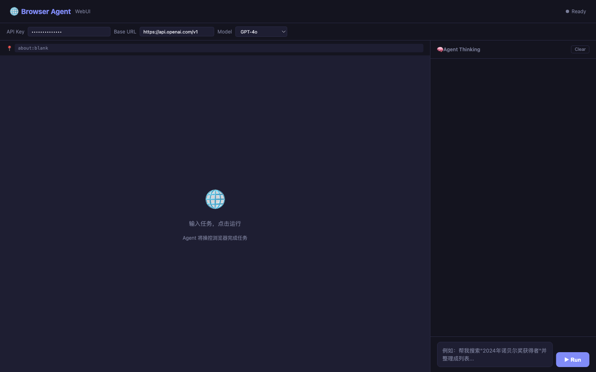
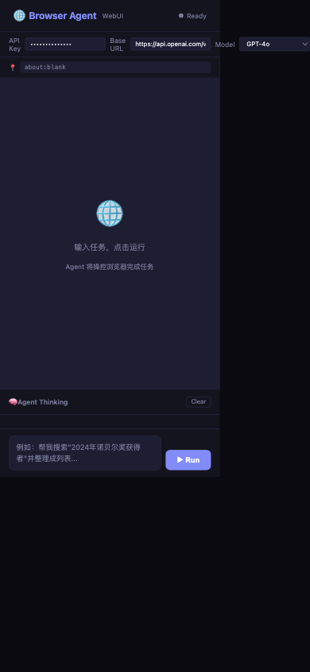

# 🌐 Browser Agent WebUI

<p>
  <strong>AI 浏览器代理的可视化界面。实时观看 AI 浏览网页、点击、提取信息。</strong>
  ·
  <em>A web interface for AI browser agents. Watch AI navigate, click, and extract information in real-time.</em>
</p>

> 用自然语言控制浏览器，AI 帮你完成任务。
> Control the browser with natural language. Let AI handle the rest.

[]()

---

## ✨ 功能 / Features

<details open>
<summary><strong>🇨🇳 中文</strong></summary>

| 功能 | 说明 |
|------|------|
| **🌐 实时浏览器视图** | 实时看到 AI 正在浏览的页面 |
| **🧠 思考日志** | 逐行观看 AI 的推理过程 |
| **🔧 任意 LLM** | 支持 OpenAI、Anthropic、DeepSeek、Qwen 等 |
| **📋 任务自动化** | 搜索、填表、提取数据、导航网站 |
| **🎯 一键运行** | 输入任务，点击运行，观看执行 |
</details>

<details>
<summary><strong>🇬🇧 English</strong></summary>

| Feature | Description |
|---------|-------------|
| **🌐 Live Browser View** | See exactly what the AI is doing in real-time |
| **🧠 Thinking Log** | Watch the AI's reasoning step by step |
| **🔧 Any LLM** | Works with OpenAI, Anthropic, DeepSeek, Qwen, and more |
| **📋 Task Automation** | Search, fill forms, extract data, navigate websites |
| **🎯 One-Click Run** | Type a task, click Run, watch it happen |
</details>

---

## 🚀 快速开始 / Quick Start

<details open>
<summary><strong>🇨🇳 中文</strong></summary>

```bash
# 1. 安装后端依赖
cd backend
pip install -r requirements.txt
playwright install chromium

# 2. 配置 API Key
cp .env.example .env
# 编辑 .env，填入你的 API Key

# 3. 启动后端
uvicorn main:app --host 0.0.0.0 --port 8000 --reload

# 4. 打开前端
# 直接用浏览器打开 frontend/index.html
# 或在前端目录启动 HTTP 服务：
cd frontend && python3 -m http.server 8080
```
</details>

<details>
<summary><strong>🇬🇧 English</strong></summary>

```bash
# 1. Install backend dependencies
cd backend
pip install -r requirements.txt
playwright install chromium

# 2. Configure API Key
cp .env.example .env
# Edit .env with your API key

# 3. Start backend
uvicorn main:app --host 0.0.0.0 --port 8000 --reload

# 4. Open frontend
# Open frontend/index.html in your browser
# Or serve it:
cd frontend && python3 -m http.server 8080
```
</details>

---

## 📸 截图 / Screenshots


*主界面：左侧浏览器视口，右侧 Agent 思考日志*
*Main UI: browser viewport on the left, agent thinking log on the right*

---



*配置 API Key 和模型参数*
*Configure API key and model parameters*

---



*移动端适配*
*Mobile responsive view*
```

---

## 🛠️ 工作原理 / How It Works

<details open>
<summary><strong>🇨🇳 中文</strong></summary>

1. **用户输入任务**（如"搜索 2024 年诺贝尔奖得主"）
2. **Agent 启动浏览器**（基于 Playwright）
3. **Agent 思考**（调用配置的 LLM 决定下一步）
4. **Agent 执行**（导航、点击、输入、提取...）
5. **你实时观看**浏览器画面和思考过程
6. **Agent 完成**任务并展示结果
</details>

<details>
<summary><strong>🇬🇧 English</strong></summary>

1. **User types a task** (e.g., "Search for Nobel Prize winners 2024")
2. **Agent starts a browser** via Playwright
3. **Agent thinks** using the configured LLM
4. **Agent acts** (navigate, click, type, extract...)
5. **You watch** the live browser and thinking process
6. **Agent finishes** and shows the result
</details>

---

## 📡 API

| 路由 / Route | 方法 / Method | 说明 / Description |
|-------------|--------------|-------------------|
| `/start` | POST | 启动 Agent 会话 / Start a new agent session |
| `/stream/{id}` | GET | SSE 流式返回 / Stream agent actions |
| `/screenshot/{id}` | GET | 获取当前截图 / Get current screenshot |
| `/stop/{id}` | POST | 停止 Agent / Stop and cleanup |

---

## 📜 License

MIT
